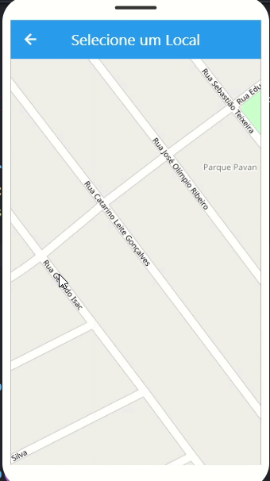

# Minhas Viagens ✈️🗺️

Um aplicativo Flutter para registrar viagens com localização geográfica, visualização no mapa e armazenamento de histórico.

### 🌐 Versão Web (Flutter Web)
🔗 [Acesse aqui](https://preview.flutlab.io/thullio_ferreira/minhas-viagens/)

---

## 🚀 Como executar o projeto

### 1. Clone o repositório
```bash
git clone https://github.com/seu-usuario/minhas-viagens.git
cd minhas-viagens
```

# 📦 Tecnologias e pacotes usados
- Flutter SDK

- geolocator – para capturar localização do dispositivo

- google_maps_flutter – para exibir mapa

- http – para requisições HTTP (ex: Nominatim ou Google Geocoding)

- flutter_launcher_icons – personalização de ícones

- shared_preferences – armazenamento local de histórico

# 🎬 Demonstração em vídeo

<p float="left">
  
</p>
